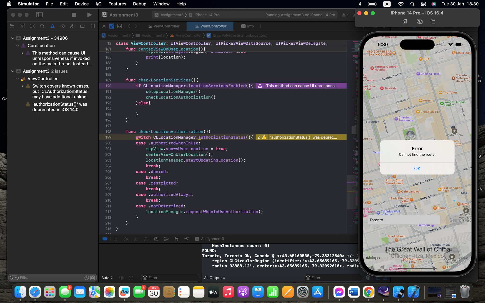
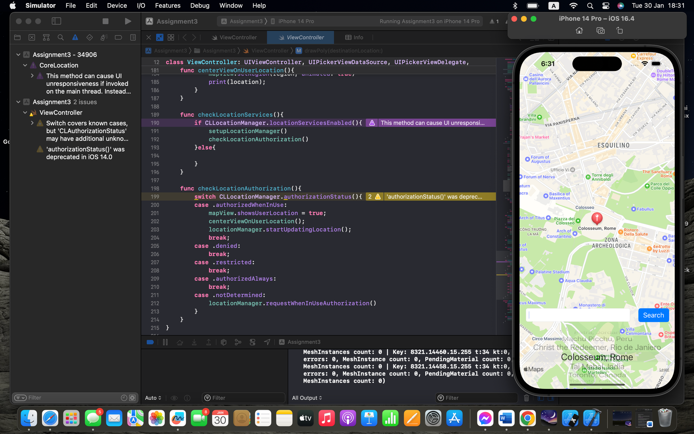

# iOS Location Tracker App

## Overview

This iOS application, developed using Swift, is designed to provide users with a seamless experience in tracking their current location and navigating to a selected destination. The app leverages the power of Swift to deliver a user-friendly interface and robust location services.

## Features

- **Location Tracking:** The app allows users to instantly view their current location on a map, providing real-time updates as they move.

- **Destination Selection:** Users can easily set a destination on the map, and the app will calculate and display the optimal path from their current location to the selected destination.

- **Navigation:** The application offers step-by-step navigation guidance, ensuring users reach their chosen destination efficiently.

## Technologies Used

- **Swift:** The entire project is developed using Swift, taking advantage of its powerful and intuitive features for iOS app development.

- **Core Location Framework:** The Core Location framework is employed to access and manage location-related information, facilitating accurate location tracking.

- **MapKit Framework:** MapKit is utilized to integrate detailed and interactive maps, allowing users to visualize their location and route.

## How to Use

1. **Open the App:** Launch the app on your iOS device.

2. **View Current Location:** The map will display your current location in real-time.

3. **Set Destination:** Tap on the map to set your desired destination.

4. **Navigation Guidance:** The app will calculate the optimal path and provide turn-by-turn navigation instructions.

## Installation

To run the app on your iOS device:

1. Clone the repository to your local machine.
   ```bash
   git clone https://github.com/your-repo.git
	```
2. Open the project in Xcode.

3. Build and run the app on your iOS device or simulator.

## Demo


